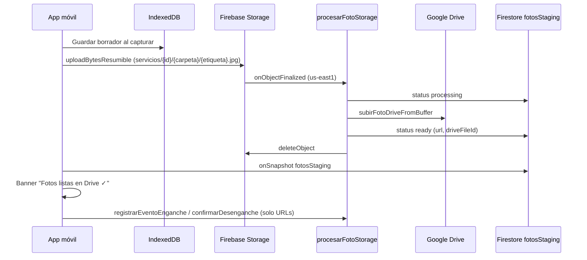

# Subida de fotos vía Firebase Storage

> Documentación del flujo implementado en jun 2025: Storage como buffer temporal, Google Drive como archivo definitivo, trigger `procesarFotoStorage`.

---

## Resumen en una frase

El operador sube fotos comprimidas a **Firebase Storage** (resumible desde el celular); un **trigger** las mueve a **Google Drive**, registra el resultado en **`fotosStaging`**, borra el archivo de Storage, y el frontend confirma el enganche/desenganche con las URLs ya listas.

---

## Por qué cambiamos el enfoque

| Enfoque anterior | Problema |
|---|---|
| Callable `subirFotoEvento` con base64 en JSON | Lento en 3G, límite ~10 MB por request, 4 cold starts en paralelo, sin reanudación si se corta la señal |

| Enfoque actual | Beneficio |
|---|---|
| `uploadBytesResumible` → Storage → trigger → Drive | Mejor transporte desde móvil, progreso visible, un solo pipeline por foto |

**Google Drive sigue siendo el archivo oficial** (carpetas legibles por humanos). Storage es solo un pasillo temporal (segundos/minutos).

---

## Flujo completo



### Pasos para el operador

1. Sacar 4 fotos (borrador en IndexedDB si recarga la página).
2. Con las 4 listas → precarga automática a Storage.
3. Ver banner: `Subiendo fotos (2/4)…` → `Procesando en Drive…` → `Fotos subidas y listas en Drive ✓`.
4. Confirmar fotos → callable liviano (sin base64).
5. Enganche: luego `iniciarTraslado` (paso separado en `FotoGuiada`).

Si falla la subida: mensaje de error + botón **Reintentar subida de fotos**. Las fotos **no se pierden** en el celular (IndexedDB + slots).

---

## Archivos del código

### Frontend

| Archivo | Rol |
|---|---|
| `frontend/src/services/fotoStorage.service.ts` | Upload resumible, listener `fotosStaging`, `subirFotosViaStorage` |
| `frontend/src/services/foto.service.ts` | Orquesta subida vía Storage; `registrarEventoEnganche` con URLs |
| `frontend/src/services/fotoCache.service.ts` | Borrador IndexedDB (sin cambios de propósito) |
| `frontend/src/components/shared/FotoLoteUpload.tsx` | Precarga, progreso, reintentar, confirmar |

### Backend

| Archivo | Rol |
|---|---|
| `functions/src/index.ts` | Export `procesarFotoStorage` (trigger Storage) |
| `functions/src/services/fotoStorage.service.ts` | Parse path, Drive, staging, borrar Storage |
| `functions/src/services/drive.service.ts` | `subirFotoDriveFromBuffer` (+ wrapper base64 legacy) |
| `functions/src/services/servicio.service.ts` | Limpia `fotosStaging` al registrar enganche/desenganche |

### Reglas

| Archivo | Qué protege |
|---|---|
| `storage.rules` | Solo `creadoPor` del servicio puede escribir en `servicios/{servicioId}/**` |
| `firestore.rules` | Lectura/borrado de `fotosStaging` por operador dueño; escritura solo Functions |

---

## Rutas y datos

### Firebase Storage

```
servicios/{servicioId}/{enganche|desenganche}/{ETIQUETA}.jpg
```

Ejemplo: `servicios/abc123/enganche/DELANTERA.jpg`

Metadata en upload: `uid`, `servicioId`, `carpeta`, `etiqueta`, `index`.

### Firestore staging

Subcolección: `servicios/{servicioId}/fotosStaging/{carpeta}_{etiqueta}`

Ejemplo doc id: `enganche_DELANTERA`

| Campo | Valores |
|---|---|
| `status` | `processing` \| `ready` \| `error` |
| `carpeta` | `enganche` \| `desenganche` |
| `etiqueta` | `DELANTERA`, `LADO_DERECHO`, etc. |
| `url`, `driveFileId` | Cuando `ready` |
| `error` | Mensaje si `error` |

Se limpia al registrar enganche o desenganche en el backend.

### Google Drive

Misma estructura que antes: `Gruas/YYYY-MM-DD/LEGAJO/PATENTE_INFRACCION/{enganche,desenganche}/...`

---

## Regiones

| Recurso | Región |
|---|---|
| Bucket Storage `gruasbacar.firebasestorage.app` | **us-east1** |
| Trigger `procesarFotoStorage` | **us-east1** (obligatorio: misma región que el bucket) |
| Callables HTTP (`iniciarEnganche`, etc.) | **us-central1** |

Error típico si no coinciden: *"A function in region us-central1 cannot listen to a bucket in region us-east1"*.

---

## Deploy

### Comando correcto

```bash
firebase deploy --only functions:procesarFotoStorage,firestore:rules,storage
```

### Errores comunes de deploy

| Comando / error | Causa | Solución |
|---|---|---|
| `--only storage:rules` | Storage **no** soporta filtro `:rules` (a diferencia de Firestore) | Usar `--only storage` |
| Región function ≠ bucket | Trigger en us-central1, bucket en us-east1 | `region: 'us-east1'` en `onObjectFinalized` |
| IAM policy failed | Primer trigger Storage; faltan roles en service accounts | Ver sección IAM abajo |
| `storage.buckets.get denied` (Eventarc) | Falta rol en `gcp-sa-eventarc` | `storage.legacyBucketReader` en SA Eventarc |
| Cross-service rules 403 | Falta rol en `gcp-sa-firebasestorage` | `datastore.user` en SA Firebase Storage |

### Secret requerido

`GOOGLE_DRIVE_FOLDER_ID` — igual que el resto de functions con Drive.

### Callable legacy

`subirFotoEvento` sigue existiendo por compatibilidad; el frontend **ya no lo usa** para el flujo normal (usa Storage).

---

## IAM — setup inicial (una sola vez)

Al desplegar el **primer trigger de Storage**, Firebase necesita permisos entre service accounts de Google. **No son roles para usuarios humanos.**

Debe hacerlo el **Propietario** del proyecto (`admin@bacarsa.com.ar`) o alguien con permiso real de `setIamPolicy` (a veces `iam.admin` alcanza en papel pero la org bloquea con 403).

### Service accounts necesarias (resumen)

| # | Principal | Rol(es) | Para qué |
|---|---|---|---|
| 1 | `service-231607744664@gs-project-accounts.iam.gserviceaccount.com` | Pub/Sub Publisher | Storage publica evento de archivo nuevo |
| 2 | `service-231607744664@gcp-sa-pubsub.iam.gserviceaccount.com` | Service Account Token Creator | Pub/Sub encadena el evento |
| 3 | `231607744664-compute@developer.gserviceaccount.com` | Cloud Run Invoker + Eventarc Event Receiver | Ejecutar la function |
| 4 | `service-231607744664@gcp-sa-eventarc.iam.gserviceaccount.com` | **Storage Legacy Bucket Reader** | Eventarc valida el bucket (`storage.buckets.get`) al crear el trigger |
| 5 | `service-231607744664@gcp-sa-firebasestorage.iam.gserviceaccount.com` | **Cloud Datastore User** | Reglas Storage con `firestore.get(...)` (cross-service rules) |

> **Project number:** `231607744664` · **Project id:** `gruasbacar`

### Cuatro asignaciones base (trigger Pub/Sub → Eventarc → Run)

### Comandos gcloud (equivalente a la consola IAM)

```bash
gcloud projects add-iam-policy-binding gruasbacar \
  --member=serviceAccount:service-231607744664@gs-project-accounts.iam.gserviceaccount.com \
  --role=roles/pubsub.publisher

gcloud projects add-iam-policy-binding gruasbacar \
  --member=serviceAccount:service-231607744664@gcp-sa-pubsub.iam.gserviceaccount.com \
  --role=roles/iam.serviceAccountTokenCreator

gcloud projects add-iam-policy-binding gruasbacar \
  --member=serviceAccount:231607744664-compute@developer.gserviceaccount.com \
  --role=roles/run.invoker

gcloud projects add-iam-policy-binding gruasbacar \
  --member=serviceAccount:231607744664-compute@developer.gserviceaccount.com \
  --role=roles/eventarc.eventReceiver
```

### Dos asignaciones extra (si falla el deploy con errores abajo)

**A) Error:** `storage.buckets.get denied` / Eventarc could not validate bucket

```bash
gcloud projects add-iam-policy-binding gruasbacar \
  --member=serviceAccount:service-231607744664@gcp-sa-eventarc.iam.gserviceaccount.com \
  --role=roles/storage.legacyBucketReader
```

**B) Warning/error:** `Cross-service Storage rules` / `firestore.get` en `storage.rules`

Nuestras rules usan `firestore.get` para verificar `creadoPor`. Firebase intenta otorgar esto al deployar; si falla con 403, el Owner debe ejecutar:

```bash
gcloud projects add-iam-policy-binding gruasbacar \
  --member=serviceAccount:service-231607744664@gcp-sa-firebasestorage.iam.gserviceaccount.com \
  --role=roles/datastore.user
```

Sin el rol B, las rules **se despliegan** pero la validación `creadoPor` en Storage **puede no funcionar** hasta que se otorgue.

**Importante:** dar todos los roles a la cuenta de Storage **no reemplaza** las asignaciones en Pub/Sub y Compute. Cada rol va en su principal.

### Si sigue fallando con 403 Policy update access denied

- El proyecto está bajo **organización** (`284123920735`).
- Revisar política **Domain restricted sharing** en IAM & Admin → Organization policies.
- Solo un admin de organización puede relajarla si bloquea service accounts.

### Compute Engine API

Opcional pero recomendado si el deploy muestra warning:

```bash
gcloud services enable compute.googleapis.com --project=gruasbacar
```

Firebase puede seguir con fallback si está deshabilitada; el bloqueo real suele ser IAM.

---

## UI — qué ve el operador

| Estado | Banner |
|---|---|
| Subiendo | `Subiendo fotos (n/4)…` + línea técnica Storage/Drive |
| Drive | `Procesando en Drive…` |
| OK | Verde: `Fotos subidas y listas en Drive ✓` |
| Error | Rojo + **Reintentar subida de fotos** |

Solo en flujos con `prefetchUpload` (enganche/desenganche operador). **Actas manuales** (`NuevaActaManualPage`) aún suben al confirmar (sin precarga).

---

## Manejo de errores

| Momento | Qué pasa |
|---|---|
| Precarga falla | Banner error + reintentar; fotos siguen en IndexedDB |
| Falla al confirmar | No se crea evento en Firestore; reintentar |
| Fotos en Drive, falla traslado | Enganche OK; botón "Continuar al traslado" |
| Sin red | Borrador local OK; subida bloqueada hasta tener señal |
| Subida parcial (sin Storage resumible completo) | Reintentar lote; posibles huérfanos en Drive (no bloquean) |

---

## Emuladores locales

```bash
npm run emulators
```

Requiere `VITE_USE_EMULATORS=true`. Storage + Functions deben correr juntos para que el trigger funcione. Drive en dev puede omitirse con `FOTOS_OPCIONALES_DEV=true` en functions.

---

## Costo (plan Blaze)

Storage temporal: centavos. Se borra tras procesar en Drive. El gasto principal sigue siendo Functions + Firestore + Drive.

---

## Pendiente / mejoras futuras

- [ ] Textos de progreso más amigables (sin "Storage"/"Drive" para operadores)
- [ ] Precarga en actas manuales
- [ ] Cola offline (outbox) si se corta red mid-upload
- [ ] Separar botón "Iniciar traslado" del de confirmar fotos (UX performance)

---

## Referencias cruzadas

- `docs/contexto/decisiones.md` — entrada "Storage como buffer"
- `docs/contexto/errores-conocidos.md` — deploy Storage/IAM
- `docs/contexto/arquitectura.md` — flujo de datos actualizado
